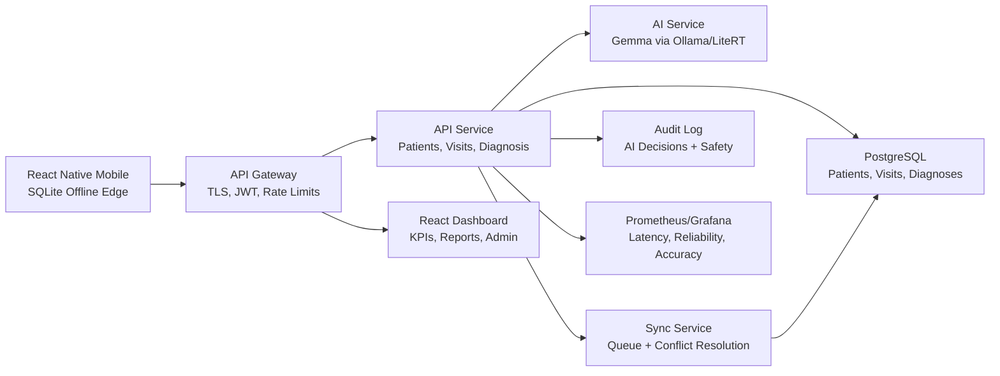

# MediScribe Production System Design

MediScribe is now structured as an offline-first edge healthcare system with cloud sync, AI safety, analytics, and a demo-ready story.

## 1. Modular Architecture

The mobile app is the offline edge layer. It never waits on cloud sync before showing red-flag guidance. The cloud layer handles API orchestration, AI inference, sync, dashboard analytics, audit logs, and monitoring.

## 2. Data Flow

1. Health worker starts a guided consultation.
2. Voice, text, or chart data is stored immediately in SQLite.
3. Local clinical rules identify emergency red flags even offline.
4. When backend is reachable, API service runs the agentic pipeline.
5. Diagnosis Agent ranks likely conditions.
6. Reasoning Agent explains the evidence in simple language.
7. Treatment Agent produces next steps and referral guidance.
8. Safety Agent blocks unsafe outputs and escalates red flags.
9. Sync Service resolves queued mobile records into PostgreSQL.
10. Dashboard visualizes KPIs, trends, outcomes, and evaluation metrics.

## 3. AI Performance

Production inference strategy:

- Run Gemma in 4-bit or 8-bit quantized form.
- Keep prompts compact and JSON-structured.
- Use temperature 0.1 for deterministic behavior.
- Cache repeated medical query patterns.
- Run deterministic red-flag rules before LLM inference.
- Return fallback triage if AI is slow, unavailable, or low confidence.

Targets:

- P95 diagnosis response: under 2 seconds in production profile.
- Offline red-flag response: under 500 ms.
- Cache-hit response: under 250 ms.
- Reliability target: at least 98%.

## 4. Safety and Reliability

Safety controls:

- Vital range validation before diagnosis.
- Red-flag escalation for shock, low SpO2, pregnancy/postpartum danger signs, pediatric danger signs.
- Refer-to-doctor fallback when AI confidence is low.
- Unsafe certainty language blocked.
- Audit log for every AI decision or safety escalation.
- Role-based access for health worker, doctor, and admin.
- JWT/API-key support for production deployments.

## 5. Backend and Data

Production schema model:

- patients: identity, age, gender, conditions, allergies, local clinic metadata.
- visits: patient_id, intake source, transcript, vitals, offline sync state.
- diagnoses: ranked differentials, confidence, treatment plan, red flags, model source.
- sync_items: mobile queue operations, conflict status, acknowledgements.
- audit_logs: decision hash, actor, patient, assessment, safety event.

Conflict resolution:

- Mobile records are idempotent by record_id.
- Newest clinical note is preserved.
- Conflicting vitals or demographics are marked for doctor review.
- Sync acknowledgement tells mobile which records are safe to clear.

## 6. Mobile UX

The mobile app now uses a five-step consultation path:

1. Register patient.
2. Capture symptoms by voice, chart scan, or manual entry.
3. Review structured patient summary.
4. Generate AI diagnosis and explanation.
5. Open treatment and referral guidance.

UX principles:

- Large touch targets.
- Minimal text.
- Offline status always visible.
- Multilingual selection.
- Risk colors: red, yellow, green.
- No cloud loading dependency for emergency advice.

## 7. Dashboard

Dashboard improvements:

- Clinic KPIs.
- Diagnosis trends.
- Urgent cases.
- Accuracy, latency, reliability, and cache metrics.
- Production architecture view.
- Hackathon story beats.
- CSV export and print/PDF report workflow.

## 8. Deployment

Docker Compose services:

- api-gateway: Nginx routing.
- api-service: Express API and diagnosis orchestration.
- sync-service: sync worker profile.
- ai-service: Ollama/Gemma runtime.
- postgres: production database.
- dashboard: React/Vite web UI.
- prometheus: metrics scrape.
- grafana: operational dashboard.

Cloud compatibility:

- AWS: ECS/Fargate + RDS + ALB + CloudWatch.
- GCP: Cloud Run/GKE + Cloud SQL + Load Balancer + Cloud Monitoring.
- Azure: Container Apps/AKS + Azure Database for PostgreSQL + Application Gateway.

## 9. Hackathon Demo

Demo story:

- Before: rural worker handles 50+ patients daily with inconsistent triage.
- Live: worker speaks symptoms, gets structured summary and urgent red flags.
- AI: agents produce ranked diagnosis, explanation, treatment, and safety guardrail output.
- Offline: backend/AI unavailable still returns safe triage.
- Dashboard: judges see accuracy, latency, reliability, trends, and impact.

Demo URLs:

- `/api/diagnoses/demo-output`
- `/api/diagnoses/evaluation`
- `/api/diagnoses/performance`
- `/api/system/architecture`
- `/api/system/demo-pack`

## 10. Success Metrics

| Metric | Target |
| --- | --- |
| Diagnosis accuracy | 85%+ scenario benchmark |
| Red-flag recall | 100% for emergency demo cases |
| P95 latency | under 2 seconds production profile |
| Offline success rate | 98%+ consultations saved locally |
| Reliability | 98%+ API/safety pipeline success |
| Usability score | 90%+ task completion in demo workflow |
